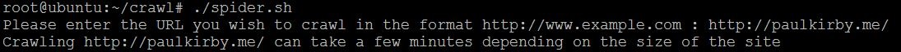
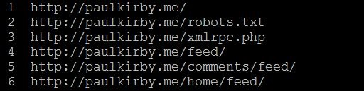

# webcrawler

spider.sh is a simple webcrawler script that crawls a given url and creates a sitemap of a website. This script can be run on any Linux OS (spider.sh should have execute permission). To run the script on a windows machine cygwin utility must be installed (https://cygwin.com/install.html) and to run the script on a mac wget must be installed (https://coolestguidesontheplanet.com/install-and-configure-wget-on-os-x/).

The web crawler script in spider.sh prompts the user to enter the URL they wish to crawl and in a few minutes prints out the sitemap on the screen. Depending on the requirements the sitemap output can be filtered to exclude links to css, js and fonts.

# user prompt

# sitemap output

